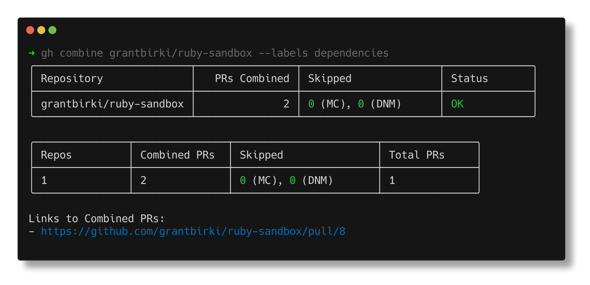

# gh-combine

[](https://github.com/github/gh-combine/actions/workflows/test.yml)
[](https://github.com/github/gh-combine/actions/workflows/build.yml)
[](https://github.com/github/gh-combine/actions/workflows/lint.yml)
[](https://github.com/github/gh-combine/actions/workflows/golangci-lint.yml)
[](https://github.com/github/gh-combine/actions/workflows/release.yml)

A gh cli extension to automatically combine multiple pull requests into one.



## About ⭐

This project is a gh cli extension that is used to combine multiple pull requests into one. It is inspired by the [github/combine-prs](https://github.com/github/combine-prs) Action but with a focus on the gh cli.

The primary use case for this extension is to combine multiple pull requests from dependabot into one. Even though dependabot supports [grouped version updates](https://github.blog/changelog/2023-06-30-grouped-version-updates-for-dependabot-public-beta/), these groups are limited by their type. For example, you cannot have dependabot combine a group of Ruby and JavaScript updates into one pull request. They are treated as separate groups. This extension solves that problem by bundling those updates into one pull request.

## Installation 💻

Install this gh cli extension by running the following command:

```bash
gh extension install github/gh-combine
```

### Upgrading

You can upgrade this extension by running the following command:

```bash
gh ext upgrade combine
```

## Usage 🚀

Before we get into the usage, there are a few key concepts to understand:

- **Combining**: This is the process of taking multiple pull requests and combining them into one. This is done by creating a new pull request that contains the changes from all the combined pull requests.
- **Filtering**: If you run this CLI with no flags, it will attempt to combine all open pull requests in the repository. This is not always what you want. You can use the various flags to filter the pull requests that are combined. For example, you can filter by label, branch name, etc. See the `--help` output for more information on the available flags.

It is also important to understand what the output looks like. By default, the output is a table that shows the following information:

- Shows the repos that were operated on
- Shows the number of pull requests that were combined per repo
- Shows the number of total _combined_ pull requests that were created
- Shows the number of pull requests that were **skipped** (not combined)
  - **MC**: Merge Conflict - Means that the pull request could not be merged into the combined pull request due to a merge conflict
  - **DNM**: Did not Match - Means that the pull request did not match the filters (criteria) that were applied

### Demo 📹

https://github.com/user-attachments/assets/e993e282-5182-4599-aca8-531a80ec124f

### Basic

Basic usage of the `combine` command to combine multiple dependent pull requests into one for a given repository:

```bash
gh combine owner/repo
```

> By default, this command will attempt to combine all open pull requests in the repository. You should use generally use some form of filtering to limit the number of pull requests that are combined. See the examples below for more information.

### Basic with Dependabot

Combine all open pull requests in a repository that are created by dependabot:

```bash
gh combine owner/repo --dependabot
```

### In Dry Run Mode

You can run in dry run mode to see what would happen without actually creating a pull request or combining any pull requests:

```bash
gh combine owner/repo --dry-run
```

### With Passing CI

Combine multiple pull requests together but only if their CI checks are passing:

```bash
gh combine owner/repo --require-ci
```

### With Passing CI and Approvals

```bash
gh combine owner/repo --require-ci --require-approved
```

### Combine Pull Requests from Multiple Repositories

```bash
gh combine owner/repo1 owner/repo2

# alternatively separate with a comma
gh combine owner/repo1,owner/repo2

# or use the --owner flag if all the repos are owned by the same owner
gh combine --owner owner repo1 repo2 repo3
```

### Use a File to Specify Repositories

```bash
gh combine --file repos.txt
```

Where `repos.txt` is a file with a list of repositories to combine (one per line):

```txt
owner/repo1
owner/repo2
owner/repo3
```

### Require a Minimum Number of PRs to Combine

By using the `--minimum` flag you can require a minimum number of pull requests that must be combined for a new PR to be opened. If less than the minimum number of pull requests are combined, the command will exit without opening a new PR.

```bash
gh combine owner/repo --minimum 3
```

### Do Not Auto-Close Linked PRs

By default, the source pull requests that are combined into the new pull request will be automatically closed when the combined Pr merges by adding the `closes` keyword to the new pull request. This can be disabled by using the `--no-autoclose` flag.

```bash
gh combine owner/repo --no-autoclose
```

### Only Combine Pull Requests that match a given Label(s)

```bash
gh combine owner/repo --labels dependencies
```

You can also require a set of multiple labels

```bash
gh combine owner/repo --labels security,dependencies
```

> Note that the labels are OR'd together. So if a pull request has either label, it will be included in the combined pull request. Meaning that if you use `--labels security,dependencies` and a pull request has the `security` label, it will be included in the combined pull request even if it does not have the `dependencies` label.

### Only Combine Pull Requests that match a given Regex

```bash
gh combine owner/repo --branch-regex "dependabot/.*"
```

### Only Combine Pull Requests that match a branch prefix

```bash
gh combine owner/repo --branch-prefix "dependabot/"
```

### Only Combine Pull Requests that match a branch suffix

```bash
gh combine owner/repo --branch-suffix "-some-cool-feature"
```

### Ignore Pull Requests that have a certain Label(s)

```bash
gh combine owner/repo --ignore-labels wip,dependencies
```

> Note that labels are OR'd together. So if a pull request has either label, it will be ignored in the combined pull request. Meaning that if you use `--ignore-labels wip,dependencies` and a pull request has the `wip` label, it will be ignored in the combined pull request even if it does not have the `dependencies` label.

### Update the Resulting Combined Pull Request Branch if Possible

```bash
gh combine owner/repo --update-branch
```

### Disable Stats Output

```bash
gh combine owner/repo --no-stats
```

### Change the Type of Stats Output

```bash
gh combine owner/repo --output table # default format
gh combine owner/repo --output json
gh combine owner/repo --output plain
```

### Disable Color

```bash
gh combine owner/repo --no-color
```

### Running with Debug Logging

```bash
LOG_LEVEL=DEBUG gh combine owner/repo
```

---

Run `gh combine --help` for more information and full command/options usage.
